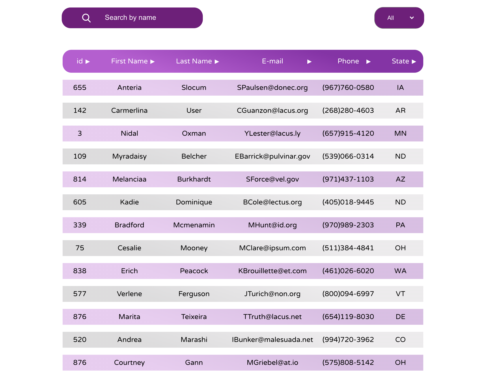

# Client Manager 
Client management table made with ReactJS.
The goal was to learn functional components and understand how to manage state with hooks.
The application is made on the basis of Pro-React-Redux course [https://www.udemy.com/course/pro-react-redux/](https://www.udemy.com/course/pro-react-redux/)

 

## Features
- render client table 
- search clients 
- filter clients 
- sort clients in each column (ascending/descending order)
- pagination feature
- handling UI when data is unavaliable 

## Installation 

### Clone this repository
$ git clone [link]

### Go to the root directory
$ cd …

### Install dependencies
$ npm install

### Run the app in the development mode on [http://localhost:3000](http://localhost:3000)

$ npm start

or see deployed project on [https://olhalatun.github.io/client-table/](https://olhalatun.github.io/client-table/)

